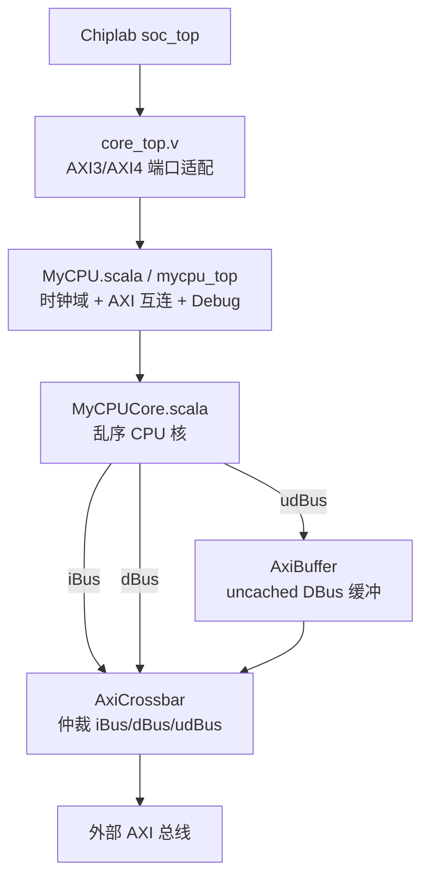
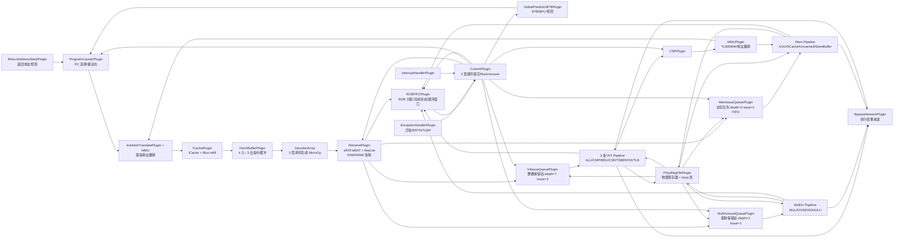
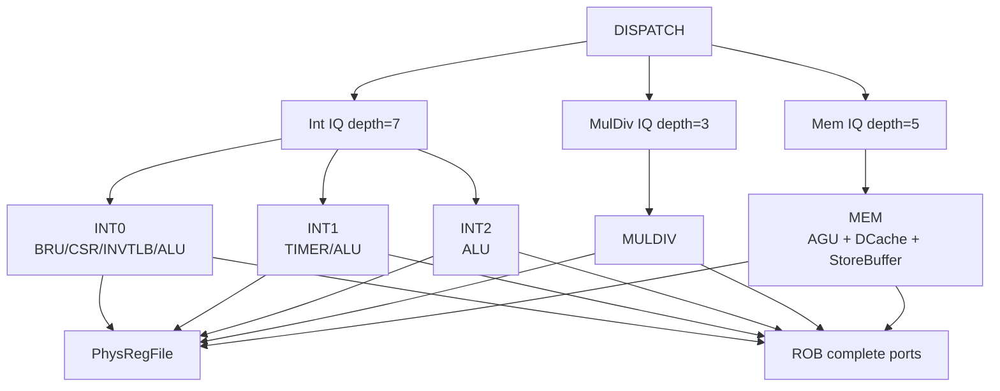
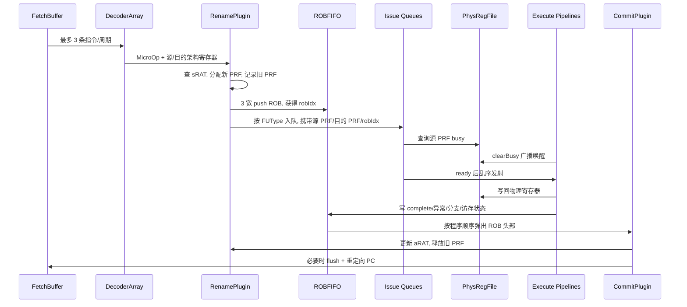

# CPU 模块功能、交互图与乱序发射分析

本文基于 `src/vivado_cannot/src` 下的 SpinalHDL 源码整理。`src/mycpu/mycpu_top.v` 是生成后的 Verilog，适合查最终信号，不适合作为架构理解入口。

## 1. 总体结论

当前 CPU 是 NOP-Core 风格的 LA32R 乱序多发射核，核心思路是：前端按 4 宽取指，后端按 3 宽译码/重命名/入 ROB，指令进入不同保留站后乱序唤醒和发射，最后由 ROB 按程序顺序最多 3 条提交。

需要特别注意：当前配置严格来说不是“乱序四发射”。它的配置是：

| 项目 | 当前参数 | 源码位置 |
| --- | ---: | --- |
| Fetch 宽度 | 4 | `FrontendConfig.fetchWidth = 4` |
| Fetch Buffer 深度 | 8 | `FrontendConfig.fetchBufferDepth = 8` |
| Decode/Rename 宽度 | 3 | `DecodeConfig.decodeWidth = 3` |
| INT Issue 宽度 | 3 | `IntIssueConfig.issueWidth = 3` |
| MULDIV Issue 宽度 | 1 | `MulDivConfig.issueWidth = 1` |
| MEM Issue 宽度 | 1 | `MemIssueConfig.issueWidth = 1` |
| ROB 深度 | 32 | `ROBConfig.robDepth = 32` |
| Commit/Retire 宽度 | 3 | `ROBConfig.retireWidth = 3` |
| 物理寄存器数 | 63 | `RegFileConfig.nPhysRegs = 31 + 32` |
| I/D Cache | 64 sets x 64B x 2 way | `ICacheConfig` / `DCacheConfig` |
| TLB | 16 项 | `TLBConfig.numEntries = 16` |

它“看起来像四发射”的原因是前端 fetchWidth 为 4，并且执行后端同时存在 `3 INT + 1 MULDIV + 1 MEM` 多条执行流水。但全局 decode/rename/ROB push/commit 都是 3 宽，所以不能称为完整四发射乱序核。

## 2. 顶层模块关系

### 顶层职责

| 模块 | 主要职责 |
| --- | --- |
| `core_top.v` | 比赛平台标准顶层壳。把 Chiplab AXI3 风格接口适配到 NOP 的 AXI4 风格接口，主要处理 `arlen/awlen` 截断、`arlock/awlock` 补位和 debug 端口映射。 |
| `MyCPU.scala` | 生成名为 `mycpu_top` 的顶层。创建时钟域，实例化 `MyCPUCore`，连接 `AxiCrossbar`、`AxiBuffer` 和 difftest/debug 信号。 |
| `MyCPUCore.scala` | 真正 CPU 核。组织 fetch、decode、INT、MULDIV、MEM 多条流水线，并挂载 ROB、提交、物理寄存器、旁路、CSR、MMU、中断等全局插件。 |
| `AxiCrossbar.scala` | 读通道仲裁 `iBus/dBus/udBus`，写通道仲裁 `dBus/udBus`。一次事务期间保持 grant，读到 `r.last` 或写到 `b.fire` 结束。 |
| `AxiBuffer.scala` | uncached DBus 前的 AXI 缓冲，降低 uncached 访问对主互连的组合压力。 |

## 3. CPU 核内部交互总图

## 4. 按流水阶段拆解

### 4.1 前端 Fetch

| 模块 | 功能 | 关键交互 |
| --- | --- | --- |
| `ProgramCounterPlugin` | 维护 `regPC` 和 `nextPC`。优先级为默认顺序 PC、预测跳转、后端重定向。 | 接收 BPU/RAS 预测；接收 Commit 的 `backendJumpInterface`；flush 时丢弃旧路径。 |
| `GlobalPredictorBTBPlugin` | 分支预测、BTB、全局历史/PHT 相关逻辑。 | 预测结果送 PC；Commit 阶段回写预测更新。 |
| `ReturnAddressStackPlugin` | 调用/返回预测辅助。 | 与 BTB/BPU、Commit 的预测恢复信息配合。 |
| `InstAddrTranslatePlugin` | 取指地址翻译。 | 调用 `MMUPlugin`，产生物理 PC 和取指异常。 |
| `ICachePlugin` | VIPT 风格 ICache 查询、miss refill、cache 操作。 | iBus 读外部 AXI；异常送 `ExceptionMuxPlugin`；fetch packet 送 FetchBuffer。 |
| `FetchBufferPlugin` | 前端与后端解耦。4 宽写入，3 宽弹出给 Decode。 | Commit flush 时清空；Decode 从 `popPorts` 取指令。 |

前端每次最多从 ICache 取 4 条，但因为 decodeWidth 是 3，进入后端的稳定宽度是 3 条/周期。

### 4.2 Decode/Rename/Dispatch

| 模块 | 功能 | 关键交互 |
| --- | --- | --- |
| `DecoderArray` | 3 路并行译码，把指令变成 `MicroOp`，标记 FU 类型、寄存器读写、分支、访存、CSR、TLB、异常等信息。 | 输入来自 FetchBuffer；输出 `DECODE_PACKET`。 |
| `RenamePlugin` | 寄存器重命名。维护 `sRAT`、`aRAT`、`freeList`，为写寄存器分配新的物理寄存器。 | 从 `freeList` pop 新 PRF；提交时根据 Commit 的 `arfCommits` 更新 `aRAT` 并释放旧 PRF；flush 时用 `aRAT` 恢复 `sRAT`。 |
| `CommitPlugin` 的 RENAME 插入逻辑 | 在 RENAME 阶段把 uop 和 rename record push 进 ROB。 | ROB 满时暂停 RENAME；输出每条指令的 `ROB_INDEXES` 给 issue queue。 |
| 三类 IssueQueue 插件 | 根据 uop 的 `fuType` 把指令送入不同保留站/队列。 | 入队时读取 PRF busy 状态，记录源操作数是否 ready。 |

Rename 解决的问题：

| 相关类型 | 解决方式 |
| --- | --- |
| RAW | 后继指令读源寄存器时，如果前面同周期有写同一架构寄存器，直接使用前面写指令分配的新物理寄存器。 |
| WAW | 每次写架构寄存器都分配新的物理寄存器，后写覆盖 `sRAT`，提交时再更新 `aRAT`。 |
| WAR | 读操作在 rename 后绑定到旧物理寄存器，后续写会分配新物理寄存器，因此不会破坏旧读。 |
| 分支/异常恢复 | Commit flush 后 `sRAT := aRAT`，freeList recover，把推测分配但未提交的 PRF 回收。 |

### 4.3 Issue Queue 与唤醒

三类队列：

| 队列 | 实现基类 | 深度 | 发射宽度 | 选择策略 |
| --- | --- | ---: | ---: | --- |
| `IntIssueQueuePlugin` | `CompressedQueue` | 7 | 3 | 每个 INT 执行流水各发一个 grant，选择 ready 且 FU 匹配的槽，避免同一槽被多个 FU 同时选中。 |
| `MulDivIssueQueuePlugin` | `CompressedFIFO` | 3 | 1 | FIFO 头部 ready 后发射。 |
| `MemIssueQueuePlugin` | `CompressedFIFO` | 5 | 1 | FIFO 头部 ready 后发射，额外受 StoreBuffer 容量约束。 |

唤醒来源：

| 唤醒类型 | 位置 | 作用 |
| --- | --- | --- |
| 入队唤醒 | DISPATCH 阶段读 `PhysRegFilePlugin.readBusy` | 如果源 PRF 当前不 busy，则入队即 ready。 |
| 远程唤醒 | `CompressedQueue/CompressedFIFO.genGlobalWakeup` | 监听 PRF 的 `clearBusys` 广播，匹配源 PRF 后置 ready。 |
| 本地唤醒 | `IntExecutePlugin.ISS` | 同一个 INT IQ 内，被本周期选中的写回目标可以提前唤醒后续槽，减少等待。 |
| 旁路取数 | `BypassNetworkPlugin` | 执行 EXE 阶段如果 PRF 读值过旧，优先从写回旁路拿最新结果。 |
| 推测唤醒失败恢复 | `SpeculativeWakeupHandler` | MEM 对 cache hit 做提前 clearBusy，若 MEM2 卡住/失败，则暂停相关 RRD，避免错误执行。 |

### 4.4 执行流水

#### INT Pipeline

每条 INT pipeline 有 `ISS -> RRD -> EXE -> WB` 四级。

| 阶段 | 功能 |
| --- | --- |
| ISS | 从 Int IQ 中请求并获得一个 ready slot。不同 INT pipeline 根据 `fuIdx` 支持不同功能。 |
| RRD | 读取物理寄存器，同时对目标 PRF 发 `clearBusy` 进行唤醒。 |
| EXE | 执行 ALU/CMP/BRU/CSR/TIMER/INVTLB 等操作；使用 bypass 修正源操作数。 |
| WB | 写回 PRF，并把完成状态、异常/分支预测结果写入 ROB。 |

INT 功能分布：

| 流水 | 特殊功能 |
| --- | --- |
| INT0 | `bruIdx=0`、`csrIdx=0`、`invTLBIdx=0`，负责分支、CSR、INVTLB 以及普通 ALU。 |
| INT1 | `timerIdx=1`，负责 timer 读以及普通 ALU。 |
| INT2 | 普通 ALU 类。 |

#### MulDiv Pipeline

负责 `MUL/MULH/DIV/MOD`，issue 宽度 1，使用独立保留站。乘法延迟配置为 2，除法支持 early-out 宽度 16。

#### MEM Pipeline

MEM pipeline 有 `ISS -> RRD -> MEM_ADDR -> MEM1 -> MEM2 -> WB -> WB2`。

| 模块 | 功能 |
| --- | --- |
| `AddressGenerationPlugin` | 生成虚拟地址、字节使能、访存类型。 |
| `MMUPlugin` | 对 load/store/cache 操作做地址翻译，判断 cached/uncached 和 TLB/权限异常。 |
| `DCachePlugin` | 处理 cached load/store、miss refill、dirty writeback、cache op。 |
| `StoreBufferPlugin` | store 地址/数据解耦，store 到提交后才真正允许执行，保证异常精确。也承载 uncached load/store 的提交后处理。 |
| `UncachedAccessPlugin` | 处理 uncached AXI 访问，走 `udBus`。 |
| `LoadPostprocessPlugin` | 对 load 数据进行 byte/half/word 对齐和符号扩展。 |
| `MemExecutePlugin` | 从 Mem IQ 发射，读 PRF，推测唤醒，WB 时写 PRF 和 ROB。 |

## 5. ROB 与精确提交

`ROBFIFOPlugin` 是乱序执行能保持精确状态的核心。它的结构分两部分：

| 部分 | 功能 |
| --- | --- |
| `robInfo` | 多端口 FIFO，保存每条指令的静态信息：uop、rename record、前端异常标记等。3 宽 push，3 宽 pop。 |
| `robState` | 随机写状态表，保存执行完成状态、异常、分支实际结果、访存地址、写回结果等。执行单元通过 random write port 更新。 |

提交逻辑在 `CommitPlugin` 中：

1. 从 ROB 头部最多查看 3 条指令。
2. 只有左侧所有指令都 complete，当前指令才允许提交。
3. 异常、预测错误、`uniqueRetire`、uncached load/store 会限制同周期提交数量。
4. 提交写寄存器指令时，向 Rename 发 `arfCommits`，更新 `aRAT` 并释放旧 PRF。
5. 若发现异常、分支预测错误、ERTN、CSR/TLB/cache 等需要刷新状态的操作，发起 flush 和 PC 重定向。
6. flush 后 ROB 和 issue queues 清空，`RenamePlugin` 用 `aRAT` 恢复 `sRAT`，freeList 恢复到精确提交边界。

## 6. 乱序执行方法分析

### 6.1 核心数据流

### 6.2 为什么能乱序

乱序来自三个机制叠加：

| 机制 | 说明 |
| --- | --- |
| 寄存器重命名 | 通过 `sRAT/aRAT/freeList` 把架构寄存器映射到物理寄存器，消除 WAR/WAW，RAW 变成等待具体 PRF 就绪。 |
| 保留站/Issue Queue | 指令 dispatch 后不再按原顺序等待执行，而是在对应队列中等待源 PRF ready。ready 的指令可以先发射。 |
| ROB 顺序提交 | 执行可以乱序完成，但 architectural state 只在 ROB 头部顺序提交，所以异常和分支恢复仍然精确。 |

### 6.3 当前发射能力如何理解

从执行资源看，一个周期理论上可能同时启动：

| 类型 | 数量 | 限制 |
| --- | ---: | --- |
| INT | 最多 3 条 | 必须在 Int IQ 中 ready，且 FU 类型与对应 INT pipeline 匹配。 |
| MULDIV | 最多 1 条 | MulDiv FIFO 头 ready。 |
| MEM | 最多 1 条 | Mem FIFO 头 ready，StoreBuffer 不接近满。 |

但从全局吞吐看：

| 环节 | 宽度 | 影响 |
| --- | ---: | --- |
| Fetch | 4 | 前端每周期最多取 4 条，用来缓冲和减少分支/ICache 波动。 |
| Decode/Rename/ROB push | 3 | 每周期最多新进入乱序窗口 3 条，这是后端入口宽度。 |
| Commit | 3 | 每周期最多退休 3 条，这是长期 IPC 上限之一。 |

所以更准确的表述是：**4 宽取指、3 宽译码/提交、后端多队列多执行单元的乱序多发射 CPU**。如果要改成真正四发射，至少要把 `decodeWidth`、ROB push/pop、rename/freeList 端口、fetch buffer pop、commit retireWidth、issue queue 入队端口、debug/difftest 提交端口等一起扩到 4，不能只改 `fetchWidth`。

## 7. 四发射改造思路

如果目标是分析“如何做乱序四发射”，可以按下面顺序评估：

### 7.1 前端

当前 `fetchWidth=4` 已经满足 4 宽取指，但 `FetchBufferPlugin` 的 pop 端口由 `decodeWidth` 决定，目前是 3。要真正四发射，需要 `decodeWidth=4` 后让 FetchBuffer 4 出。

风险点：ICache 一次最多不能跨 cache line，`ProgramCounterPlugin` 里已经按 cache line words 限制 PC 增量。4 宽下仍需确认分支 mask、valid mask、预测恢复信息都能覆盖 4 路。

### 7.2 Decode/Rename

需要把 `DecodeConfig.decodeWidth` 从 3 改到 4，并同步检查：

| 子模块 | 扩展点 |
| --- | --- |
| `DecoderArray` | 4 路译码、4 路 fetch buffer pop。 |
| `RenamePlugin` | `regReads/regWrites` 扩到 4，freeList pop 端口扩到 4，同周期 RAW/WAW 转发链变长。 |
| `ROBFIFOPlugin` | ROB push 宽度跟随 decodeWidth 到 4。 |
| 各 IssueQueue | dispatch 入队端口跟随 decodeWidth 到 4。 |

主要代价是 rename 组合路径变长：4 条指令内要处理多组同周期 RAW/WAW 比较、freeList 连续 pop、ROB push ready、IQ 入队 ready。

### 7.3 Issue/Execute

真正“四发射”有两种定义：

| 定义 | 实现含义 |
| --- | --- |
| 全局每周期最多发射 4 条 | 可以保留 `3 INT + 1 MEM/MULDIV` 之类组合，只要调度器全局限制 4 条。当前结构没有统一全局 issue limit，而是各队列独立发射。 |
| 每周期最多进入后端 4 条并最多退休 4 条 | 需要 decode/rename/ROB/commit 全 4 宽，执行端可以按资源分别发射。 |

当前结构中 Int IQ 已经 3 发射，MulDiv/Mem 各 1 发射。如果 decodeWidth 扩 4，而不加全局 issue 仲裁，则某些周期理论执行启动数可能超过 4。因此要先明确设计目标：是“4 宽机器”还是“最多 4 发射机器”。

### 7.4 Commit/ROB

真正四发射通常需要 `retireWidth=4`。这会影响：

| 子模块 | 扩展点 |
| --- | --- |
| `CommitPlugin` | `completeMask/excMask/uniqueMask/recoverMask/uncachedMask` 从 3 扩 4。 |
| `RenamePlugin` | commit push freeList 从 3 扩 4，`aRAT` 更新从 3 扩 4。 |
| `ROBFIFOPlugin` | pop 端口从 3 扩 4，旁路 ROB head state 的匹配逻辑增加。 |
| Debug/Difftest | 当前很多地方显式使用 3 路，如 `DifftestInstrCommitIndex = 0,1,2`，需要改成参数化 4 路。 |

风险点：提交阶段是控制恢复、异常、CSR/TLB/cache 操作的集中点，4 宽会显著增加掩码逻辑和优先级判断路径。

### 7.5 物理寄存器和窗口

当前物理寄存器数为 63，ROB 深度 32。四发射后如果仍保持 ROB 32，窗口能覆盖的周期数更少；如果要提升性能，通常还要考虑：

| 参数 | 当前 | 四发射考虑 |
| --- | ---: | --- |
| ROB 深度 | 32 | 可考虑 48/64，但会增大 FPGA 资源和提交/完成端口压力。 |
| PRF 数量 | 63 | 更宽 rename 下 freeList 压力更大，可考虑增加 PRF。 |
| Int IQ 深度 | 7 | 4 宽 dispatch 下可能偏小。 |
| Mem IQ 深度 | 5 | 访存密集程序可能更容易堵。 |
| StoreBuffer 深度 | 8 | 四发射下 store 突发更容易顶满。 |

## 8. 推荐阅读路径

按理解收益排序：

1. `src/vivado_cannot/src/MyCPUConfig.scala`：先记住所有宽度、队列深度、cache/TLB 参数。
2. `src/vivado_cannot/src/pipeline/core/MyCPUCore.scala`：看 CPU 核如何组装各条流水和全局插件。
3. `src/vivado_cannot/src/pipeline/decode/RenamePlugin.scala`：理解乱序的寄存器重命名基础。
4. `src/vivado_cannot/src/pipeline/core/ROBFIFOPlugin.scala`：理解 ROB 信息/状态分离和执行完成写回。
5. `src/vivado_cannot/src/pipeline/core/CommitPlugin.scala`：理解精确提交、flush、预测恢复。
6. `src/vivado_cannot/src/utils/CompressedQueue.scala` 与 `CompressedFIFO.scala`：理解 issue queue 如何选择、压缩、flush。
7. `src/vivado_cannot/src/pipeline/exe/IntExecutePlugin.scala`：理解 INT 发射、RRD、EXE、WB、旁路和 ROB 写回。
8. `src/vivado_cannot/src/pipeline/mem/DCachePlugin.scala`、`MemExecutePlugin.scala`、`StoreBufferPlugin.scala`：理解访存乱序与顺序提交之间的边界。
9. `src/vivado_cannot/src/pipeline/privilege/MMUPlugin.scala`、`CSRPlugin.scala`、`ExceptionHandlerPlugin.scala`：理解 Linux/TLB/异常相关行为。

## 9. 一句话架构描述

这个 CPU 的核心不是简单流水线，而是：**4 宽取指前端 + 3 宽译码/重命名/ROB 入队 + 物理寄存器重命名 + 多保留站乱序唤醒发射 + 多执行流水写回 + 3 宽 ROB 顺序精确提交**。
